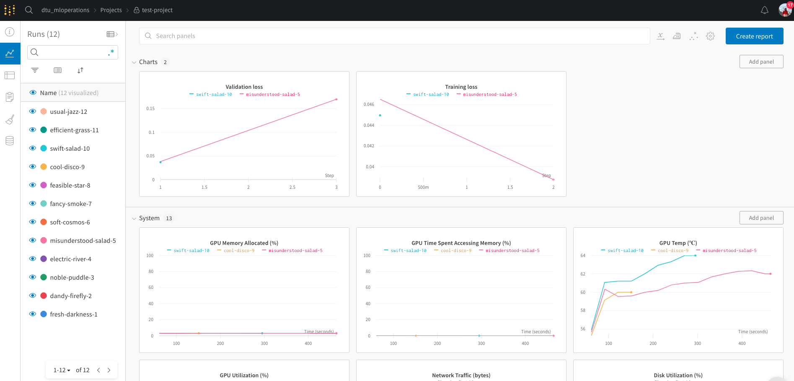
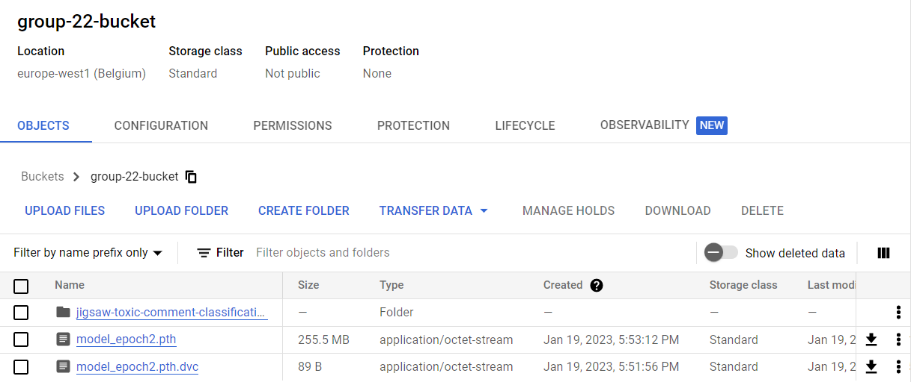
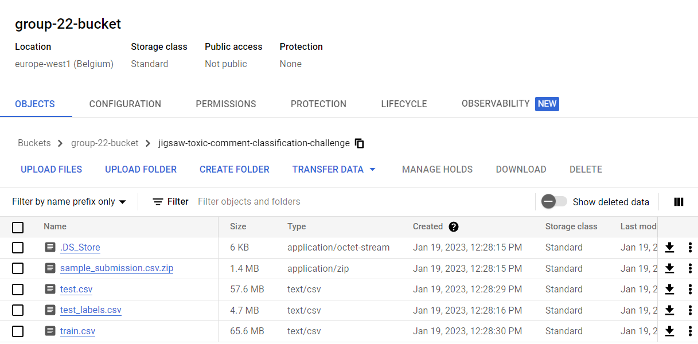
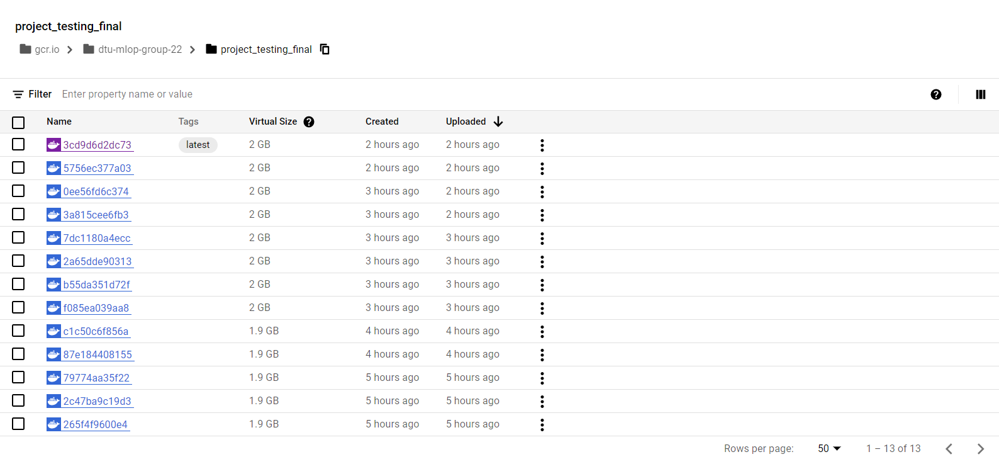
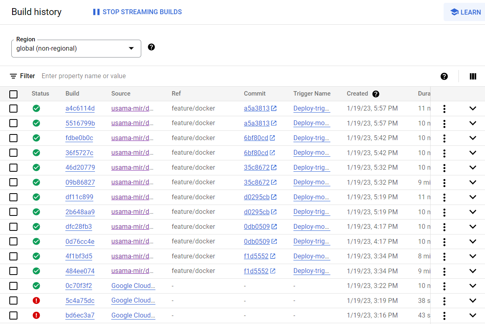

# Exam template for 02476 Machine Learning Operations

This is the report template for the exam. Please only remove the text formatted as with three dashes in front and behind
like:

```--- question 1 fill here ---```

where you instead should add your answers. Any other changes may have unwanted consequences when your report is auto
generated in the end of the course. For questions where you are asked to include images, start by adding the image to
the `figures` subfolder (please only use `.png`, `.jpg` or `.jpeg`) and then add the following code in your answer:

```markdown

```

In addition to this markdown file, we also provide the `report.py` script that provides two utility functions:

Running:

```bash
python report.py html
```

will generate an `.html` page of your report. After deadline for answering this template, we will autoscrape
everything in this `reports` folder and then use this utility to generate an `.html` page that will be your serve
as your final handin.

Running

```bash
python report.py check
```

will check your answers in this template against the constrains listed for each question e.g. is your answer too
short, too long, have you included an image when asked to.

For both functions to work it is important that you do not rename anything. The script have two dependencies that can
be installed with `pip install click markdown`.

## Overall project checklist

The checklist is *exhaustic* which means that it includes everything that you could possible do on the project in
relation the curricilum in this course. Therefore, we do not expect at all that you have checked of all boxes at the
end of the project.

### Week 1

* [x] Create a git repository
* [x] Make sure that all team members have write access to the github repository
* [x] Create a dedicated environment for you project to keep track of your packages
* [x] Create the initial file structure using cookiecutter
* [x] Fill out the `make_dataset.py` file such that it downloads whatever data you need and
* [x] Add a model file and a training script and get that running (M)
* [x] Remember to fill out the `requirements.txt` file with whatever dependencies that you are using (N)
* [x] Remember to comply with good coding practices (`pep8`) while doing the project (Pol)
* [x] Do a bit of code typing and remember to document essential parts of your code (Pol)
* [x] Setup version control for your data or part of your data
* [x] Construct one or multiple docker files for your code (U, N)
* [x] Build the docker files locally and make sure they work as intended (U, N)
* [x] Write one or multiple configurations files for your experiments (Pol)
* [x] Used Hydra to load the configurations and manage your hyperparameters (Pol)
* [ ] When you have something that works somewhat, remember at some point to to some profiling and see if
      you can optimize your code
* [x] Use Weights & Biases to log training progress and other important metrics/artifacts in your code. Additionally,
      consider running a hyperparameter optimization sweep. (Pol)
* [ ] Use Pytorch-lightning (if applicable) to reduce the amount of boilerplate in your code

### Week 2

* [x] Write unit tests related to the data part of your code (S)
* [x] Write unit tests related to model construction and or model training (M, S)
* [x] Calculate the coverage. (S, M)
* [x] Get some continuous integration running on the github repository (U,N)
* [x] Create a data storage in GCP Bucket for you data and preferable link this with your data version control setup (N)
* [x] Create a trigger workflow for automatically building your docker images (U,N)
* [x] Get your model training in GCP using either the Engine or Vertex AI 
* [x] Create a FastAPI application that can do inference using your model
* [ ] If applicable, consider deploying the model locally using torchserve
* [x] Deploy your model in GCP using either Functions or Run as the backend

### Week 3

* [ ] Check how robust your model is towards data drifting
* [ ] Setup monitoring for the system telemetry of your deployed model 
* [ ] Setup monitoring for the performance of your deployed model
* [x] If applicable, play around with distributed data loading
* [x] If applicable, play around with distributed model training 
* [ ] Play around with quantization, compilation and pruning for you trained models to increase inference speed

### Additional

* [x] Revisit your initial project description. Did the project turn out as you wanted?
* [x] Make sure all group members have a understanding about all parts of the project
* [x] Uploaded all your code to github

## Group information

### Question 1
> **Enter the group number you signed up on <learn.inside.dtu.dk>**
>
> Answer:

Group 22

### Question 2
> **Enter the study number for each member in the group**
>
> Example:
>
> *sXXXXXX, sXXXXXX, sXXXXXX*
>
> Answer:

s184424, s134187, s222433, s183190, s221623

### Question 3
> **What framework did you choose to work with and did it help you complete the project?**
>
> Answer length: 100-200 words.
>
> Example:
> *We used the third-party framework ... in our project. We used functionality ... and functionality ... from the*
> *package to do ... and ... in our project*.
>
> Answer:

We used cookie-clutter for code structure. GitHub for version control. DVC for storing the raw data. Docker for virtual environment. Hydra for hyperparameter tuning. Wardb to visualize and log the training of the different models. Pytest for unittesting. Google Cloud for VMs and buckets. FastAPI for interacting with our model.

## Coding environment

> In the following section we are interested in learning more about you local development environment.

### Question 4

> **Explain how you managed dependencies in your project? Explain the process a new team member would have to go**
> **through to get an exact copy of your environment.**
>
> Answer length: 100-200 words
>
> Example:
> *We used ... for managing our dependencies. The list of dependencies was auto-generated using ... . To get a*
> *complete copy of our development enviroment, one would have to run the following commands*
>
> Answer:

We created a requirements.txt file using pipreqs, which means that only the dependencies we are actually using are included in the file. If a new team member joined the team, they simply needed to create an environment, we recommend a conda-environment, and run the following command to get the dependencies: 'pip install -r requirements.txt'

### Question 5

> **We expect that you initialized your project using the cookiecutter template. Explain the overall structure of your**
> **code. Did you fill out every folder or only a subset?**
>
> Answer length: 100-200 words
>
> Example:
> *From the cookiecutter template we have filled out the ... , ... and ... folder. We have removed the ... folder*
> *because we did not use any ... in our project. We have added an ... folder that contains ... for running our*
> *experiments.*
> Answer:

We expect that you initialized your project using the cookiecutter template.
Explain the overall structure of your code. Did you fill out every folder or only a subset?
Answer: Only a subset of the folders have been filled. The project folder consists of a data folder where
the raw and the processed csv files are located. The src folder consists multiple folders:
the data folder contains the dataset.py file in which the pytorch dataset file is defined and a make_dataset.py
file that is processing the raw data into the final form.
The models folder contains the train_model.py that is responsible for the training of the model.
Fianlly the tests folder contains files that test the model and the data used to train the model.

### Question 6

> **Did you implement any rules for code quality and format? Additionally, explain with your own words why these**
> **concepts matters in larger projects.**
>
> Answer length: 50-100 words.
>
> Answer:

Flake8 was used to understand which code
was not following the code standards. The code not following the standards was then formatted using
black. Consitency is very important in software development.
Formatted code is easier to read and follow and reduces the risk of mistakes and allows for
better collaboration on software development.

## Version control

> In the following section we are interested in how version control was used in your project during development to
> corporate and increase the quality of your code.

### Question 7

> **How many tests did you implement and what are they testing in your code?**
>
> Answer length: 50-100 words.
>
> Example:
> *In total we have implemented X tests. Primarily we are testing ... and ... as these the most critical parts of our*
> *application but also ... .*
>
> Answer:

We have implemented tests that test that the data is loaded correctly, mainly the size of
the dataset used for training the model, the format of the data and that the data is loaded
correctly into the pytorch dataset class. Furthermore once the data was loaded a random datapoint
from the dataset was sampled and checked that it has the right shape.
A few other tests were implemented to check the the model behaves as expected. A model was asked to make
a prediction on a random data point and it was checked that the shape of the output matches with the expected shape.

### Question 8

> **What is the total code coverage (in percentage) of your code? If you code had an code coverage of 100% (or close**
> **to), would you still trust it to be error free? Explain you reasoning.**
>
> Answer length: 100-200 words.
>
> Example:
> *The total code coverage of code is X%, which includes all our source code. We are far from 100% coverage of our **
> *code and even if we were then...*
>
> Answer:

The code coverage for the model and the data part of the project was over 95% but there are still other aspects
left to be tested such as the training of the model, or testing the fastapi application. Even if we would have managed
to create tests for these parts as well, it will still not be guaranteed that our code would be error free. As it is
time consuming to write unit tests other types of metrics. Unit tests have also a very limited scope, and even having a high
number of unit tests cannot that the code is 100% free from bugs.

### Question 9

> **Did your workflow include using branches and pull requests? If yes, explain how. If not, explain how branches and**
> **pull request can help improve version control.**
>
> Answer length: 100-200 words.
>
> Example:
> *We made use of both branches and PRs in our project. In our group, each member had an branch that they worked on in*
> *addition to the main branch. To merge code we ...*
>
> Answer:

We had a lot of branches for our project. We started by defining a branch naming convention to be “feature/feature-name” so we were consistent with how the naming were done. We branched out on every bigger feature to be made - for instance for the implementation of tests. PRs were used for the main branch. The way to effectively circumvent issues with conflicts were to pull new changes on the local main branch first. Merge the changes to the feature branch the person was working on and afterwards push the changes and create a pull request. That way we never had to resolve conflicts directly with the main branch. 

### Question 10

> **Did you use DVC for managing data in your project? If yes, then how did it improve your project to have version**
> **control of your data. If no, explain a case where it would be beneficial to have version control of your data.**
>
> Answer length: 100-200 words.
>
> Example:
> *We did make use of DVC in the following way: ... . In the end it helped us in ... for controlling ... part of our*
> *pipeline*
>
> Answer:

We started by using DVC and initially it worked really well and made it easier to push and pull our data as that were stored elsewhere. Along the way we ended up with quite a lot of issues since there were issues with the versions and this ultimately meant we weren’t able to use the features that much more since dvc crashed everytime. We ended moving everything to the git bucket instead to be used there without dvc.

### Question 11

> **Discuss you continues integration setup. What kind of CI are you running (unittesting, linting, etc.)? Do you test**
> **multiple operating systems, python version etc. Do you make use of caching? Feel free to insert a link to one of**
> **your github actions workflow.**
>
> Answer length: 200-300 words.
>
> Example:
> *We have organized our CI into 3 separate files: one for doing ..., one for running ... testing and one for running*
> *... . In particular for our ..., we used ... .An example of a triggered workflow can be seen here: <weblink>*
>
> Answer:

We have set up GitHub actions to do CI. We only tested the code on a ubuntu machine since we are going to run our code on linux machines only. The CI was set to be triggered on PRs and pushes to the main branch and mainly it took care of the unittesting of our code. It proved to be quite a hassle as we were having many issues with DVC and afterwards had to change to google cloud bucket. Although it looked easy to just change the code we ended moving our data manually to google cloud bucket. Then we had to create a google service account to be able to pull the data. For this to work we created a small bashscript that takes the authentication file from secrets and uses It to establish a connection to the google cloud and from there we can pull our data into our CI to do the tests.

## Running code and tracking experiments

> In the following section we are interested in learning more about the experimental setup for running your code and
> especially the reproducibility of your experiments.

### Question 12

> **How did you configure experiments? Did you make use of config files? Explain with coding examples of how you would**
> **run a experiment.**
>
> Answer length: 50-100 words.
>
> Example:
> *We used a simple argparser, that worked in the following way: python my_script.py --lr 1e-3 --batch_size 25*
>
> Answer:

We used hydra to configure the hyperparameters from a config.yaml file, that has the following format:
hyperparameters: batch_size: 64 lr: 0.01 epochs: 10 step_size: 212 gamma: 0.1 n_classes: 7
The file was then imported using a decorator in the main function from train_model.py in the following way:
@hydra.main(config_name=“config.yaml”) def main(cfg:Dict) -> None:
The values of the hyperparameters are then defined as:
lr=cfg.hyperparameters.lr 

### Question 13

> **Reproducibility of experiments are important. Related to the last question, how did you secure that no information**
> **is lost when running experiments and that your experiments are reproducible?**
>
> Answer length: 100-200 words.
>
> Example:
> *We made use of config files. Whenever an experiment is run the following happens: ... . To reproduce an experiment*
> *one would have to do ...*
>
> Answer:

--- question 13 fill here ---

### Question 14

> **Upload 1 to 3 screenshots that show the experiments that you have done in W&B (or another experiment tracking**
> **service of your choice). This may include loss graphs, logged images, hyperparameter sweeps etc. You can take**
> **inspiration from [this figure](figures/wandb.png). Explain what metrics you are tracking and why they are**
> **important.**
>
> Answer length: 200-300 words + 1 to 3 screenshots.
>
> Example:
> *As seen in the first image when have tracked ... and ... which both inform us about ... in our experiments.*
> *As seen in the second image we are also tracking ... and ...*
>
> Answer:

To assess the training of the model we have used wandb. This tool helps keep track of the different experiments, and the hyperparameters defined for each one. We have logged the training and validation losses, that correspond to the Binary Cross Entropy between the target and the input probabilities. The output of the model are the probabilities of a sentence of belonging to each of the seven different classes of toxicity. This loss helps the model understand how far is the output to the values that it should predict. Since the loss is computed over the whole batch, we log to wandb the average, defined as following:
wandb.log({“Training loss”: loss/len(Train_DL)})
The loss is then logged after each batch for every epoch. In the case of the validation loss, we use a separate dataset, that helps us evaluate the capability of the model to infer on new data, and see if the training is biased towards the training dataset





### Question 15

> **Docker is an important tool for creating containerized applications. Explain how you used docker in your**
> **experiments? Include how you would run your docker images and include a link to one of your docker files.**
>
> Answer length: 100-200 words.
>
> Example:
> *For our project we developed several images: one for training, inference and deployment. For example to run the*
> *training docker image: `docker run trainer:latest lr=1e-3 batch_size=64`. Link to docker file: <weblink>*
>
> Answer:

Docker were used to both train and deploy the trained model with a small backed application. The docker containers were initially taught to be easily deployable but we had many issues with the training dying all the time. We found out that the model we were using needed 12 gb of memory to be able to run. Afterwards we have used two images. We initially wanted to use a combination of makefiles and docker-compose to run our different images but we didn’t get to that due to time constraints.


### Question 16

> **When running into bugs while trying to run your experiments, how did you perform debugging? Additionally, did you**
> **try to profile your code or do you think it is already perfect?**
>
> Answer length: 100-200 words.
>
> Example:
> *Debugging method was dependent on group member. Some just used ... and others used ... . We did a single profiling*
> *run of our main code at some point that showed ...*
>
> Answer:

We used the built in python debugger and we used traced once during the project. Otherwise we were having issues with docker, github actions and the gpc where it probved to be a lot harder to use proper debugging tools. A good workaround for github actions were to do the bash scripting locally first, get it to work and then run it on the workflow file. With the gpc we had the logfiles for the different servics and otherwise the documentation helped us as well. Docker we learned that when no output is coming with an error message - increase the memory!

## Working in the cloud

> In the following section we would like to know more about your experience when developing in the cloud.

### Question 17

> **List all the GCP services that you made use of in your project and shortly explain what each service does?**
>
> Answer length: 50-200 words.
>
> Example:
> *We used the following two services: Engine and Bucket. Engine is used for... and Bucket is used for...*
>
> Answer:

First of all, for giving grant to teammates, IAM & admin was in use. Next, compute engine was used for
building VM(Virtual Machine) instances, and cloud build was in use for buidling triggers. For checking if images
are stored correctly as a consequence of trigger, container registry was in use. For storing data related to the
project, cloud storage was also in use, for creating and managing buckets.

### Question 18

> **The backbone of GCP is the Compute engine. Explained how you made use of this service and what type of VMs**
> **you used?**
>
> Answer length: 100-200 words.
>
> Example:
> *We used the compute engine to run our ... . We used instances with the following hardware: ... and we started the*
> *using a custom container: ...*
>
> Answer:

Basically, we used computer engine for building VM instance.
By cloning our project's github repository, we could train the modle on VM and also mounted and unmounted the buckets cloud as well.
Since the account owner gave grants to other teammates, each of teammate could access to VM with his or her own username.
Looking into machine configuration, our main instance's type is n1-standard-1, and GPUs is specified as '1 x NVIDIA V100'.
We also had the other instance using CPU, but there was a problem with training the model on VM so we had discarded it and moved to the main instance which uses GPU, then the error during the training was not occurred.

### Question 19

> **Insert 1-2 images of your GCP bucket, such that we can see what data you have stored in it.**
> **You can take inspiration from [this figure](figures/bucket.png).**
>
> Answer:








### Question 20

> **Upload one image of your GCP container registry, such that we can see the different images that you have stored.**
> **You can take inspiration from [this figure](figures/registry.png).**
>
> Answer:





### Question 21

> **Upload one image of your GCP cloud build history, so we can see the history of the images that have been build in**
> **your project. You can take inspiration from [this figure](figures/build.png).**
>
> Answer:





### Question 22

> **Did you manage to deploy your model, either in locally or cloud? If not, describe why. If yes, describe how and**
> **preferably how you invoke your deployed service?**
>
> Answer length: 100-200 words.
>
> Example:
> *For deployment we wrapped our model into application using ... . We first tried locally serving the model, which*
> *worked. Afterwards we deployed it in the cloud, using ... . To invoke the service an user would call*
> *`curl -X POST -F "file=@file.json"<weburl>`*
>
> Answer:

--- question 22 fill here ---

### Question 23

> **Did you manage to implement monitoring of your deployed model? If yes, explain how it works. If not, explain how**
> **monitoring would help the longevity of your application.**
>
> Answer length: 100-200 words.
>
> Example:
> *We did not manage to implement monitoring. We would like to have monitoring implemented such that over time we could*
> *measure ... and ... that would inform us about this ... behaviour of our application.*
>
> Answer:

--- question 23 fill here ---

### Question 24

> **How many credits did you end up using during the project and what service was most expensive?**
>
> Answer length: 25-100 words.
>
> Example:
> *Group member 1 used ..., Group member 2 used ..., in total ... credits was spend during development. The service*
> *costing the most was ... due to ...*
>
> Answer:

--- question 24 fill here ---

## Overall discussion of project

> In the following section we would like you to think about the general structure of your project.

### Question 25

> **Include a figure that describes the overall architecture of your system and what services that you make use of.**
> **You can take inspiration from [this figure](figures/overview.png). Additionally in your own words, explain the**
> **overall steps in figure.**
>
> Answer length: 200-400 words
>
> Example:
>
> *The starting point of the diagram is our local setup, where we integrated ... and ... and ... into our code.*
> *Whenever we commit code and puch to github, it auto triggers ... and ... . From there the diagram shows ...*
>
> Answer:

--- question 25 fill here ---

### Question 26

> **Discuss the overall struggles of the project. Where did you spend most time and what did you do to overcome these**
> **challenges?**
>
> Answer length: 200-400 words.
>
> Example:
> *The biggest challenges in the project was using ... tool to do ... . The reason for this was ...*
>
> Answer:

Our main struggle was using the cloud and especially in combination with Docker.
The first problem we encountered was that two members out of five ran out of credits straight away on google cloud (and weren't able to tell why).
Having to master both VMs and buckets was a major challenge, and even though the course material on this subject was super nicely made we still felt like we lacked a basic understanding of the clound and the services. Another point was the general confusion about when to use DVC and buckets.
Understanding GitHub actions and how to integrate it into the project was challenging. Generally dealing with many different tools and configuration files were difficult, lots and lots of debugging.
When using docker the error messages were not always present and having to build the image from almost scratch each time took a very long time.  Also, we found the lack of TA help and the always long queue for help a bit of a hassle as we were stuck in problems for long periods of time.
Being five people working on a relatively small project was also a challenge, but by using branching we did manage to avoid huge merge conflicts.

### Question 27

> **State the individual contributions of each team member. This is required information from DTU, because we need to**
> **make sure all members contributed actively to the project**
>
> Answer length: 50-200 words.
>
> Example:
> *Student sXXXXXX was in charge of developing of setting up the initial cookie cutter project and developing of the*
> *docker containers for training our applications.*
> *Student sXXXXXX was in charge of training our models in the cloud and deploying them afterwards.*
> *All members contributed to code by...*
>
> Answer:

--- question 27 fill here ---
